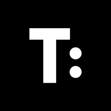

# Experience

## Home Automation Architect & Builder

### Cabinroad 2020 to Present 

Developed and engineered a comprehensive Home Automation & Building Management System, automating lighting, ventilation, climate control, and appliances throughout my residence.

Automated tasks based on real-time sensor data and scheduled conditions based on time, sun position, energy prices, resulting in energy reduction and convenience.

This project provided valuable hands-on experience in:

-   Full-stack development: Designed and coded a PWA (Service Worker + Web Components) for remote control from anywhere in the world.
-   Embedded systems: Designed and manufactured custom PCBs using EasyEDA, KiCAD, and JLCPCB for hardware control.
-   High availability infrastructure: Implemented an automatic failover system with a native data center based on Kubernetes, Ceph, and MetalLB, ensuring continuous operation.
-   Experience with Rust on the ESP32-S3 platform

## Lead Developer

### Lingio 2016 - 2020 

As Tech Lead for the main product's front-end, an interactive quiz-style Progressive Web App, I spearheaded the overall technical direction. This encompassed system design, architecture, and the code powering the application.

Drawing on my diverse development skills, I actively contributed to various aspects, including programming new features, building a robust foundation, and ensuring seamless performance across Android, iPhone, and web platforms. Additionally, I fostered a strong team by mentoring and training new members, empowering them to tackle any challenge.

Key areas of responsibility:

-   System Design: Laying the blueprint for a smooth and scalable user experience.
-   Software Programming: Bringing the design to life with clean, efficient code.
-   Architecture: Ensured stability and performance by building a solid foundation.
-   Software Engineering: Implemented best practices and tools for smooth operations.
-   Hiring and Training: Mentored and trained new developers, testers, Q&A, building a skilled and collaborative team.
-   Multi-Platform Support: Ensured flawless app performance across Android, iPhone, and web.

> Mika has architected and been solely responsible for the development of our complex single page webapp. He has a very good understanding of both application and API design and has the ability and patience to convert all plans to reality. He has also shown good leadership capabilities leading and coaching others to work with him. Mika is honest and easy to communicate with and he has an urge to always improve himself, the product, and all processes which makes it a joy to work with him to achieve something great.
>
>  \- Morten Diesen, Chief Technical Officer at Lingio

## CTO

### Dooify 2015 - 2016 

At Dooify, a platform enabling service exchange using time-based currency, I led the development of the Web App. Working in a fast-paced startup environment allowed me to hone my skills in entrepreneurship and prepared me to take on greater responsibilities.

## Senior Developer

### Pingdom 2014 - 2015 

At Pingdom, I focused on software architecture and methodologies to ensure projects are held to a high level of quality, leveraging Agile, Test-Driven Development, and SOLID principles. I actively reviewed and improved overall design.

I played a key role in enhancing the core product algorithm, processing data from 300,000 deployments with 10-second updates. I implemented comprehensive unit, integration, and end-to-end tests, ensuring confidence in maintaining the product during ongoing development.

## IT Consultant

### Purecontent 2013 

At Purecontent, I played a pivotal role in developing a web-based collaboration platform dedicated to optimizing the end-to-end process of content creation.

Tasked with creating a tool, I designed a solution that empowered contributors—writers, editors, project managers, and administrators—to seamlessly collaborate within a user-friendly and secure environment.

The implemented solution involved developing stand-alone and RESTful components in Ruby, complemented by a JavaScript front-end using ExtJs technology for a "Desktop-like" experience within a web browser.

As the sole creator, I assumed diverse roles, including customer relations, software architecture, development, database and server administration, design, and testing.

> I have been so impressed with Mika's work for Purecontent. The system I wanted was in my head and on various pieces of paper or graphical sketches. Mika took those and interpreted them well, offering suggestions for shortcuts, improvements or extra features that could be incorporated for little extra effort. When he didn't know something, he told me, then he went off and learned about it in his own time and came back to put it into practice. Great work and we'd welcome you back for more when we're ready.
>
>  \- Richard Blundell, Finance and Operations Director

## Software Engineer

### Artirix 2011 - 2012 

Back- and frontend development of classified ads websites in Ruby on Rails and Python.

## Open Source Developer

### Applied Language Solutions 2010 - 2011 

I was an open-source developer at ALS, focusing on SquidgeIt—a highly scalable and distributed platform for general-purpose applications.

I led the development of a C# framework for rapid application building, ensuring compatibility on Linux/Mono and Windows/.Net. Additionally, I implemented a Ruby-based system for automated testing and deployment.

My expertise encompasses C#, Mono, system design, Ruby, and internet protocols. I played a pivotal role in creating an open-source, object-oriented, and distributed system for widespread use.

> Mika is an extremely self motivated and talented engineer. His enthusiasm was most welcome and his analytical skills invaluable. It was a pleasure to work with him and I wish him all the best.
>
> \- Mark Hartigan-Davies, Senior Software Engineer

<!-- -->

> Mikael is a highly inventive and innovative application developer. He has a passion for his work and is one of those rare people who both loves what he does and has a real talent for it.
>
>  \- Gareth Gower, Development Manager

## System Developer

### Viewserve 2009 - 2011 

I successfully oversaw the design and implementation of a real-time data collection system for vehicles, deploying it across 900 units in Sweden, France, and Dubai.

This role showcased my expertise in system design, embedded systems, C programming, and internet protocols. In a subsequent project-based position, I contributed to Viewserve's advancements by addressing challenges in 1-Wire technology, CAN, and data storage, demonstrating skills in systems engineering, project leadership, and Java development.

Later, I served as the architect of a backend service for generating statistical documents using historical sensor data. This multifaceted role involved queuing systems, supporting various output formats, and ensuring platform compatibility on .Net/Windows and Mono/Linux.

My contributions extended to less-priority projects, showcasing proficiency in C#, distributed systems, and diverse internet protocols.

> Managing Mikael was a pleasant experience and I warmly recommend him for any type of software project. I always appreciated his constant strive to deliver software of high quality and that he wasn't afraid to challenge existing practices to achieve this. His wide competence makes him a great asset and I'm sure he will in short time become a key figure in any team.
>
>  \- Ramzi Ferchichi, Software Architect

## Lab Assistant

### Mälardalen University 2008 + 2009

In parallel of my studies I also worked for the university.

-   Teaching & supporting
-   Examination & grading

## IT Support

### Transcom 2006 - 2007 

Tech supporter at Transcom on behalf of Tele2s, with focus areas on dial-up, broadband, and sales.
